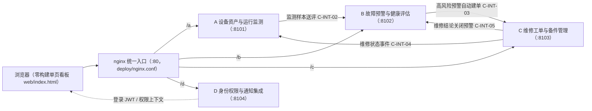

# 工业设备智能运维与预测性维护系统

面向智能制造的设备运行监测、故障预警与运维管理平台（2026 移动云杯 AI Coding 赛道参赛作品）。

系统围绕"设备监测 → 故障预警 → 维修工单处置 → 备件与验收 → 恢复运行"的完整业务闭环，由四个 FastAPI 微服务与一个零构建单页看板组成：高风险/严重预警自动创建维修工单，维修结论反向关闭预警并恢复设备状态，全程数据可追溯。

- 契约驱动：`contracts/openapi.yaml`（v2，20 个路径 / 24 个操作）为接口唯一事实源，`contracts/shared-enums.json` 统一 7 个 roleCode / 21 个 permissionCode 等公共枚举；
- 权限完整：7 角色 RBAC，看板操作按钮按登录角色权限动态渲染，服务间调用经 `X-Internal-Token` 校验；
- 质量门禁：四模块 307 项测试全绿（A 21 / B 179 / C 75 / D 32）+ 顶层契约示例测试 1 项（合计 308），`scripts/check_repo.py` 契约门禁 32 项 0 警告；
- 轻量部署：无容器编排依赖，Debian 12 / Ubuntu 22.04+ 一台 2 核 4G 主机即可运行，nginx 单端口统一入口（公网只开 80）。

## 系统架构



四服务同机部署、互调走本机回环（127.0.0.1），各自使用独立 SQLite 数据库；对外推荐 nginx 单端口方案（四服务与看板全部经 80 端口，uvicorn 仅绑 127.0.0.1），亦支持 `LISTEN_HOST=0.0.0.0` 直连多端口模式（调试用）。

## 目录结构

```text
maintenance-work-order-system/
  apps/
    equipment-monitoring/     # A 设备资产与运行监测（:8101）
    fault-warning/            # B 故障预警与健康评估（:8102）
    maintenance/              # C 维修工单与备件管理（:8103）
    integration-quality/      # D 身份权限、通知与集成质量（:8104）
  contracts/
    openapi.yaml              # 机器契约：20 路径 / 24 操作
    shared-enums.json         # 公共枚举：7 roleCode / 21 permissionCode 等
    schemas/                  # 跨模块事件 Schema
    examples/                 # 契约示例报文（契约测试数据源）
    http/                     # local-api.http 联调请求集
  shared/                     # 跨模块公共约定
  tests/                      # 顶层契约示例测试
  web/
    index.html                # 零构建单页看板入口（统一入口 http://127.0.0.1:8888/）
    dashboard.html            # 旧链接兼容重定向 → index.html
  scripts/
    start_all.ps1             # Windows 一键启动四服务 + 8888 统一入口（含 Python/venv/依赖自举）
    start_all.sh              # Debian/Ubuntu 一键启动（幂等，含健康等待与依赖自举）
    dev_server.py             # 本机单端口统一入口：静态 web/ + 反代 /a /b /c /d（跨平台，Windows 用）
    check_repo.py             # 契约与结构门禁（32 项）
    check_commit_msg.py       # 提交信息格式检查（Git hook）
    e2e_demo.py               # 端到端回归演示脚本
    bootstrap.ps1 / bootstrap.sh / configure_team.py  # 四人协作初始化
  deploy/
    nginx.conf                # nginx 单端口统一入口配置
  docs/
    01_模块边界与责任矩阵.md
    06_详细接口约定与联调手册.md
    07_服务器部署说明.md
    工业设备智能运维与预测性维护系统.md   # 业务纲领
    参赛材料/作品说明文档.md              # 大赛六章模板说明文档
    所有流程路线与bug.md                 # 演示剧本与 bug 台账
  AI初步生成的结果/
    IDE提示词/                # 20 余份任务书/提示词（AI 辅助开发全过程证据）
```

## 快速开始

**Windows 本机演示**（PowerShell，需 Python 3.10+ 已加入 PATH）：

```powershell
powershell -ExecutionPolicy Bypass -File scripts\start_all.ps1
```

脚本首次运行会自动完成自举：检查 Python 版本 → 创建仓库根 `.venv` → 安装四服务依赖 → 生成各服务 `.env`（SQLite 独立数据库、统一内部令牌）→ 启动四服务并轮询 `/health` 直到就绪（最长 60 秒），最后再起一个 **8888 统一入口**（静态托管 `web/`，并把 `/a /b /c /d` 反代到四服务，与服务器 nginx 同口径）。

然后浏览器打开 **`http://127.0.0.1:8888/`**（即为统一入口，页面默认服务地址 `/a /b /c /d` 可直接用），点击快捷身份一键登录（演示密码 `demo123456`）。

> 也可以用浏览器直接打开 `web/index.html`；此时同源反代不可用，脚本会把四个服务地址框自动填成 `http://127.0.0.1:8101~8104` 直连（四个服务已开启跨域）。
> 常用参数：`-SkipInstall` 跳过依赖安装、`-NoWeb` 不启动 8888 统一入口。

收尾统一用：

```powershell
powershell -ExecutionPolicy Bypass -File scripts\start_all.ps1 -Stop
```

**Linux 服务器**（Debian 12 / Ubuntu 22.04+，python3 ≥ 3.10）：

```bash
bash scripts/start_all.sh          # 一键启动（幂等，可重复执行）
bash scripts/start_all.sh status   # 查看四服务健康状态
bash scripts/start_all.sh stop     # 停止四服务
```

按演示剧本操作：设备详情页"注入异常（严重）" → 设备变红、生成预警、自动创建工单 → 主管确认/派单 → 工程师接单/维修/提交验收 → 验收通过 → 设备恢复运行。完整剧本见 `docs/所有流程路线与bug.md`。

## 测试与契约门禁

```powershell
# 四模块共 351 项测试（A 37 / B 197 / C 81 / D 36）
Push-Location apps\equipment-monitoring;  python -m pytest -q; Pop-Location
Push-Location apps\fault-warning;         python -m pytest -q; Pop-Location
Push-Location apps\maintenance;           python -m pytest -q; Pop-Location
Push-Location apps\integration-quality;   python -m pytest -q; Pop-Location

# 顶层契约示例测试 + 仓库门禁
python -m pytest tests -q
python scripts\check_repo.py      # 32 项校验，0 警告
python scripts\e2e_demo.py        # 端到端回归（需先启动四服务）
```

门禁覆盖：必需文件、OpenAPI 3.1、operationId 唯一、接口契约编号完整、写接口幂等键、公共枚举与 OpenAPI 逐项一致、事件 Schema 示例报文校验等。

## 服务器部署（systemd 托管，阶段4）

单机真实部署（含 nginx 单端口统一入口、SSH 隧道方案、防火墙/安全组清单与 FAQ）见 **`docs/07_服务器部署说明.md`**。当前演示服务器的标准部署流程：

```bash
# 1) nginx 统一入口（8888，模板与线上口径一致）
sudo apt install -y nginx
sudo cp deploy/nginx.conf /etc/nginx/sites-available/ims
sudo ln -s /etc/nginx/sites-available/ims /etc/nginx/sites-enabled/ims
sudo rm -f /etc/nginx/sites-enabled/default
sudo nginx -t && sudo systemctl reload nginx

# 2) 四服务 systemd 托管（开机自启 + 崩溃 3s 拉起 + journald 统一日志）
bash deploy/systemd/install.sh

# 3) 验证
bash scripts/start_all.sh status    # 四服务健康
curl http://127.0.0.1:8888/a/health
```

之后浏览器访问 `http://<服务器IP>:8888/`（看板由 nginx 静态托管，默认零配置——服务地址框初始即同源 `/a`~`/d`）。

### 运维速查（systemd 模式）

| 操作 | 命令 |
| --- | --- |
| 状态/日志 | `systemctl status ims-a` · `journalctl -u ims-a -f` |
| 重启某服务 | `systemctl restart ims-b` |
| 演示数据重置 | `echo y \| python scripts/reset_demo.py`（自动经 systemctl 停起） |
| 卸载托管 | `bash deploy/systemd/install.sh --uninstall`（回退 `start_all.sh` nohup 开发模式） |

`scripts/start_all.sh` 与 `reset_demo.py` 会自动感知：装过 systemd 单元走 `systemctl`，未装则保持原 nohup 开发模式，一套入口两种模式。

## 团队分工与协作规范

| 成员 | 负责模块 | 代码目录 | 说明 |
| --- | --- | --- | --- |
| A | 设备资产与运行监测 | `apps/equipment-monitoring/` | 设备档案、遥测、状态 |
| B | 故障预警与健康评估 | `apps/fault-warning/` | 健康评分、风险等级、预警事件 |
| C | 维修工单与备件管理 | `apps/maintenance/` | 工单状态机、备件闭环（项目发起人） |
| D | 系统集成与质量保障 | `apps/integration-quality/`、`tests/` | 身份权限、通知、契约门禁、部署 |

协作方式（据实说明）：A/B/D 模块代码由 **AI 预生成**（湛卢 IDE + 提示词任务书驱动，Git 署名 zh3g）、经人工审查验收后入库；C 模块为项目发起人实现。修改 `contracts/`、`shared/` 等公共资产须受影响成员评审。分支、提交信息、Issue/PR 流程与硬规则见 `README-TEAM.md` 与 `CONTRIBUTING.md`。

## 说明

- 本仓库为 2026 移动云杯 AI Coding 赛道参赛作品，参赛说明文档见 `docs/参赛材料/作品说明文档.md`（六章模板）；
- AI 辅助开发的全过程证据（Wave0 起共 20 余份任务书与提示词）完整保留在 `AI初步生成的结果/IDE提示词/`；
- `.env` 中的内部令牌与 JWT 密钥为演示占位值，仅限演示与彩排使用，生产环境必须替换并收紧（安全建议见 `docs/07` 第六节）。
