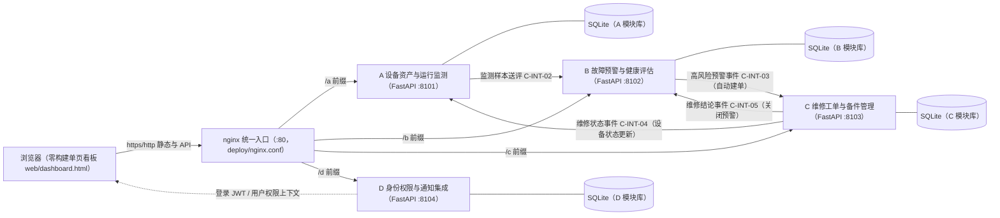

# 参赛作品说明文档

> 赛道：2026 移动云杯 AI Coding 赛道

| 信息项 | 内容 |
| --- | --- |
| 作品名称 | 工业设备智能运维与预测性维护系统 |
| 作品副标题 | 面向智能制造的设备运行监测、故障预警与运维管理 |
| 团队名称 | ＿＿＿（负责人补） |
| 队长姓名 | ＿＿＿（负责人补） |
| 队长手机号 | ＿＿＿（负责人补） |
| 团队成员（姓名 / 单位 / 角色） | ＿＿＿（负责人补） |
| 提交日期 | ＿＿＿（负责人补） |

---

## 一、作品概述

本作品是一套面向智能制造场景的工业设备智能运维与预测性维护平台，围绕"设备监测 → 故障预警 → 维修工单处置 → 备件与验收 → 恢复运行"的完整业务闭环，划分为四个 FastAPI 微服务与一个零构建单页看板：A 设备资产与运行监测、B 故障预警与健康评估、C 维修工单与备件管理、D 身份权限与通知集成。

核心痛点：制造企业生产设备数量多、运行状态难以实时掌握、设备异常发现滞后、维修过程信息分散，导致非计划停机频繁、维修依赖老师傅经验、设备与维修数据难以沉淀复用。

目标用户与场景：中小制造企业的设备科、维修班组与生产管理者。系统覆盖设备档案与实时监测、异常检测与健康评分、故障预警自动建单、工单全流程流转、备件领退闭环等日常运维场景。

核心亮点：

1. 契约驱动的微服务闭环——四服务以 OpenAPI 契约为唯一接口事实源，"严重/高风险预警 → 自动创建维修工单 → 维修结论反向关闭预警"全自动流转，无需人工搬运数据；
2. 7 角色 RBAC 权限体系——契约统一声明 7 类角色与 21 项权限，看板操作按钮按登录角色的权限动态渲染，服务间调用以内部令牌互相校验；
3. AI 原生开发范式——A/B/D 三模块代码、看板前端、部署脚本均由湛卢 IDE 按提示词任务书驱动生成、人工审查验收，全过程留有 20 余份可追溯的任务书与提示词证据。

## 二、创新性

**方案构思创新点。** 传统课程或企业 Demo 常见"三个孤立的子系统拼接"，本系统在立项之初即用一份《模块边界与责任矩阵》与《详细接口约定与联调手册》（`docs/01`、`docs/06`）把四名成员的模块边界、数据所有权、跨模块事件与状态机冻结下来，所有接口行为以 `contracts/openapi.yaml`（v2，20 个路径 / 24 个操作）为唯一机器契约，代码实现只是契约的投影。这使得"预警自动建单、维修结论反向关闭预警"的跨模块闭环不是事后打通，而是契约内置。

**技术路线原创性。** 系统采用"机器契约 + 质量门禁"的开发路线：公共枚举（`contracts/shared-enums.json`，7 个 roleCode、21 个 permissionCode）由 `scripts/check_repo.py` 做 32 项静态门禁校验（契约与 OpenAPI 逐项一致、operationId 唯一、写接口强制幂等键等），任何服务实现偏离契约都会被门禁拦下；跨模块事件统一事件包络（eventId 幂等、traceId 全链路追踪），维修工单采用"命令 + 状态机"模型（9 态、10 个 action），服务端拒绝一切契约外迁移。

**问题解法独特性。** 针对中小制造企业"买不起重型 EAM、养不起运维团队"的现实，本系统给出轻量解法：SQLite 零运维数据库、四服务同机部署互走本机回环、nginx 单端口统一入口把公网暴露面从 4 个端口收敛为 1 个、前端零构建单页（浏览器直接打开、无 Node 工具链），一台 2 核 4G 云主机即可承载完整演示与中小规模试用。

**与已有方案的差异对比。** 商用 EAM/CMMS（如 SAP PM、IBM Maximo）功能厚重、许可与实施成本高、周期以月计，中小制造企业难以负担；本系统以开源技术栈实现运维核心闭环，部署以分钟计，且把"AI 辅助开发"本身作为交付证据沉淀（任务书目录），形成"需求 → 契约 → AI 生成 → 人工验收"的可复用工程范式，与纯人工或纯生成的方案均有本质差异。

## 三、湛卢原生IDE能力运用

本项目从契约吸收到部署的全过程，采用"提示词任务书 → 湛卢 IDE 执行 → 人工实测验收 → 使用记录存档"的固定协作范式，原始证据为 `AI初步生成的结果/IDE提示词/` 目录下 20 余份任务书与提示词（Wave0 起，含方案、任务书、IDE 提示词与契约审计报告）。逐项能力运用如下：

| 湛卢 IDE 能力 | 用在什么环节 | 解决了什么问题 | 证据（IDE提示词/ 目录） |
| --- | --- | --- | --- |
| 代码智能生成 | 按 04/06/07/08 号任务书，在成员到位前由 AI 先行实现 A 设备监测、B 故障预警、D 身份集成三个模块的骨架与接口 | 解决"队友未到位、进度被阻塞"的燃眉之急，按契约快速产出可联调实现 | 09_应急方案_AI先行实现.md 及 04/06/07/08 号任务书 |
| 代码智能生成 | C 维修工单测试环境修复（conftest 补齐）与看板前端大规模生成 | 让 C 模块既有测试全绿；看板单页（温度/振动/电流趋势、设备列表、工单操作）一次性成型 | 14、17、18 号任务书 |
| 智能调试与 bug 修复 | 统一 bug 台账驱动：`docs/所有流程路线与bug.md` 登记 bug，交湛卢 IDE 定位修复，实测通过后在台账标注修复记录 | 例：登录页快捷身份缺失——定位种子数据与前端按钮缺口，补齐身份并实测权限隔离 | docs/所有流程路线与bug.md |
| 测试验证 | 为身份权限补全撰写参数化契约测试（遍历种子用户断言角色/权限与 seed 一致、权限必须属于契约枚举、登录 200/401 用例）；编写端到端回归脚本 `scripts/e2e_demo.py` | 保证"文档说的权限"与"代码落的权限"逐项一致，防止演示翻车 | 16 号任务书、各模块 tests/ |
| 代码评审与交付验收 | 每波交付后以 git diff 回交负责人审查，验收清单逐项核对（数字比对仓库、mermaid 有效性、无框线字符等） | 人机协作闭环：AI 产出必经人工审查，防止虚构事实进入交付物 | 各任务书"验收标准"与"使用记录"节 |
| 部署与运维脚本 | 生成 Windows `start_all.ps1` 与 Debian/Ubuntu `start_all.sh` 双平台一键启动（自动建 .env、依赖安装、健康等待）、`scripts/check_repo.py` 契约门禁、`deploy/nginx.conf` 单端口入口 | 让非运维背景成员也能一键起服务、一键过门禁 | 15、19、20 号任务书 |
| 跨会话项目记忆 | 湛卢 IDE 保存项目决策、环境命令、历史会话摘要，新会话直接延续上下文 | 多波次迭代不丢上下文，任务可以跨天、跨会话接续 | 湛卢 IDE 会话内记忆功能（项目侧证据为各任务书"前置状态"节） |

高阶功能使用情况（据实说明）：本项目**未使用** Skill、MCP 等扩展能力，也未引入任何第三方 AI 依赖；实际形成的可复用范式是"任务书驱动"——负责人先把需求、事实清单、硬性约束、验收标准写成编号任务书，湛卢 IDE 按书执行并回交，负责人验收后在任务书末尾"使用记录"表格存档（见各任务书第八节）。这一范式本身即是 AI Coding 赛道"AI 真实参与开发全过程"的直接证据。

## 四、技术实现

**系统架构。** 四个 FastAPI 微服务同机部署、互调走本机回环（127.0.0.1），对外通过 nginx 单端口统一入口（公网只开 80，uvicorn 仅绑 127.0.0.1）；前端为零构建单页看板 `web/dashboard.html`，浏览器直接打开即可使用。

**关键技术栈与选型理由。**

- FastAPI + Pydantic v2：接口即契约，请求/响应模型直接对齐 OpenAPI，自带文档与校验，适合契约驱动开发；
- SQLAlchemy + SQLite：零运维、单文件持久化，重启不丢历史工单与预警，适合单机部署与中小规模场景；
- 原生 JS + ECharts（本地化）单页看板：无 Node 构建链，`web/dashboard.html` 一个文件即为全部前端，评审/演示环境零门槛；
- nginx 统一入口：四服务与看板全部经一个端口对外，`/a` `/b` `/c` `/d` 前缀反代本机回环，公网暴露面收敛为 1 个端口。

**工程完成度（据实）。** 已实现：契约 20 个路径 / 24 个操作全部落地；工单 9 态状态机（10 个 action，服务端拒绝非法迁移）；备件申请 8 态状态机与库存不可覆盖流水；7 角色 21 项权限的 RBAC（登录签发 JWT、看板按钮按权限渲染、服务间 X-Internal-Token）；三类跨模块事件（WarningRaised / EquipmentStatusChanged / MaintenanceConclusionReported，eventId 幂等 + traceId 追踪）；四模块 307 项测试全绿（A 21 / B 179 / C 75 / D 32），另有顶层契约示例测试 1 项；`scripts/check_repo.py` 契约门禁 32 项 0 警告。待完善：JWT 密钥与登录默认密码为演示占位值（生产需替换并收紧）；健康评估当前为规则评分引擎（接口已预留，可平滑升级机器学习模型）；SQLite 单机无高可用（中小场景够用，大规模可替换为 PostgreSQL）。

**核心功能清单与可用性。** A 模块：设备档案增改查、遥测批量写入、状态查询（7 个操作）；B 模块：健康评估、预警查询/确认、维修结论接收（5 个操作）；C 模块：工单创建/查询/命令流转、备件与库存查询、备件申请与审批发放（8 个操作）；D 模块：登录换 JWT、当前用户上下文、指定用户上下文、通知任务（4 个操作）。全部接口支持统一错误包络（code / message / traceId / timestamp）与幂等键。

**真实部署验证。** 系统已在 Debian 12 云服务器真实部署（部署手册 `docs/07_服务器部署说明.md`）：`bash scripts/start_all.sh` 一键完成虚拟环境、依赖、.env 生成、四服务启动与健康等待；nginx 单端口方案实测 `curl /a/health` ~ `/d/health` 全部返回 UP，看板经 `http://<服务器IP>/` 直接访问；公网仅开放 80 端口，后端四端口不可直连。业务锚点：设备 EQ-000001（数控机床 CNC-001，LINE-01）主轴轴承振动异常场景，看板"注入异常"（96.7 ℃ / 9.8 mm·s⁻¹ / 18.3 A）后健康度跌破阈值产生预警并自动创建维修工单，维修验收通过后设备恢复运行，全程可在浏览器实时演示。

## 五、应用价值

**领域实用价值。** 制造业设备故障停机的代价远高于维护本身，行业普遍认同由事后维修转向预测性维护能显著降低维护总成本与非计划停机时间。本系统把"监测数据 → 健康评分 → 分级预警 → 自动工单 → 维修闭环"做成全自动流水线，并把维修过程数据（工单、备件、结论）沉淀为可追溯的数字档案，直接服务于"少停机、快修复、可复盘"的运维目标。

**落地可行性。** 部署条件：一台 2 核 4G、5G 磁盘的 Linux 主机（Debian 12 / Ubuntu 22.04+）与 Python 3.10+ 即可，无商业许可费用、无容器编排依赖、无前端构建链；部署周期：按 `docs/07` 手册从裸机到四服务可用约半小时，一键脚本幂等可重复执行；运维成本：SQLite 免安装免维护，日志与 PID 集中管理，`start_all.sh status/stop` 覆盖日常运维动作。演示阶段还提供 SSH 隧道方案，完全不对公网开放业务端口。

**市场前景。** 中小制造企业设备运维数字化需求普遍存在，但重型 EAM 的成本与实施周期把大多数企业挡在门外。本系统的可复制性体现在三个层面：其一，契约驱动的模块化架构使单个服务可独立替换或扩展（如把规则评分引擎升级为机器学习模型而不影响其余模块）；其二，设备档案、遥测、预警、工单、备件的数据模型对泵机、风机、空压机等通用设备运维场景直接适用；其三，"任务书 + AI 生成 + 人工验收"的开发范式使同类定制需求的交付成本大幅下降，为面向多行业的快速复制提供了工程基础。

## 六、附件与补充材料

**可运行代码说明。** 附件为完整可运行仓库：`apps/`（四个 FastAPI 服务，各含 src、tests、requirements.txt、.env.example）、`contracts/`（openapi.yaml、shared-enums.json、事件 Schema 与示例报文）、`web/dashboard.html`（零构建单页看板）、`scripts/`（start_all.ps1 / start_all.sh / check_repo.py / e2e_demo.py）、`deploy/nginx.conf`（单端口统一入口配置）、`tests/`（顶层契约示例测试）、`docs/`（模块边界、接口手册、部署说明等工程文档）、`AI初步生成的结果/IDE提示词/`（20 余份任务书与提示词，AI 辅助开发全过程证据）。

**演示视频说明。** 演示剧本与仓库内 `docs/所有流程路线与bug.md` 的六条流程一致：流程一主管登录浏览概览 → 流程二操作员注入异常数据、设备变红 → 流程三主管确认派单 → 流程四工程师接单维修、申请与领取备件 → 流程五主管/验收员验收 → 流程六闭环确认、设备恢复绿色、预警自动关闭。视频按此顺序录制看板操作即可完整呈现"监测 → 预警 → 工单 → 恢复"闭环。

**部署 / 运行说明。** Windows 本机：`powershell -ExecutionPolicy Bypass -File scripts\start_all.ps1` 启动四服务（首次自动生成 .env 并等待健康检查），浏览器打开 `web/dashboard.html`，快捷身份一键登录（演示密码 `demo123456`）。Linux 服务器：`bash scripts/start_all.sh` 启动，按 `docs/07_服务器部署说明.md` 第三节配置 nginx 单端口入口后，浏览器访问 `http://<服务器IP>/` 即为完整部署形态。测试与门禁：各模块 `python -m pytest -q` 共 307 项（另有顶层契约示例测试 1 项，合计 308），仓库根 `python scripts/check_repo.py` 32 项 0 警告。
